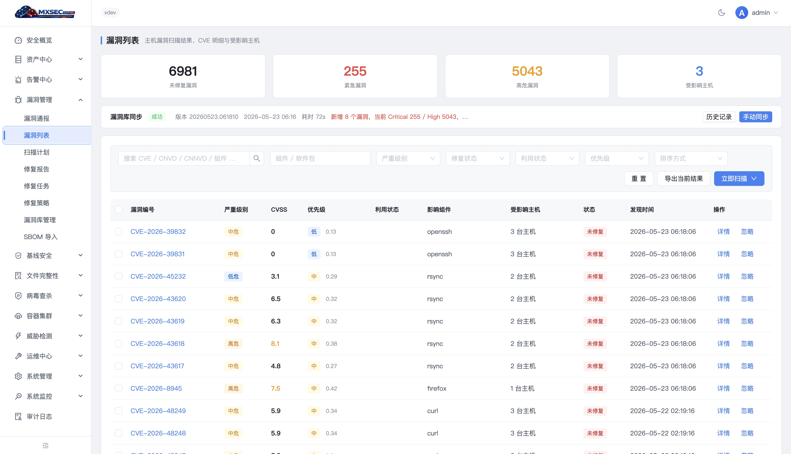
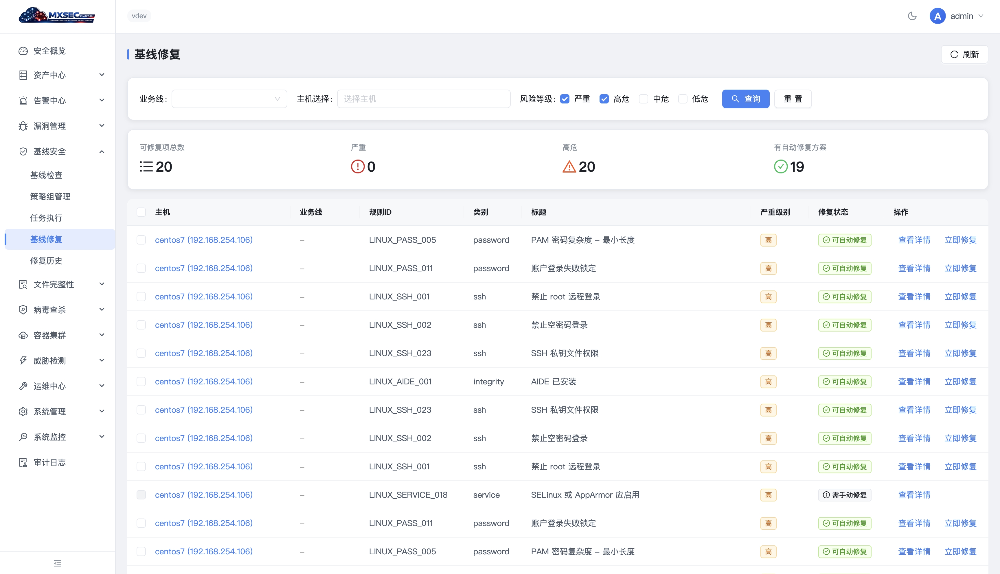
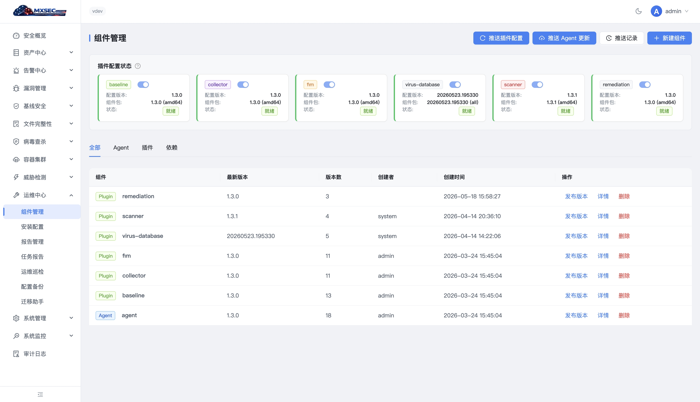

# MxSec Platform Community Edition

**English | [中文](README_ZH.md)**

[](https://github.com/imkerbos/mxsec-platform)
[](LICENSE)
[](https://github.com/imkerbos/mxsec-platform/stargazers)
[](https://github.com/imkerbos/mxsec-platform/issues)
[](https://github.com/imkerbos/mxsec-platform/commits/main)
[](https://goreportcard.com/report/github.com/imkerbos/mxsec-platform)

An open-source, enterprise-grade host and container security management platform. Covers security baselines, asset management, vulnerability scanning, antivirus, runtime detection, and compliance auditing — providing a unified management view for security operations teams.

## Community Edition

MxSec Platform **Community Edition** includes the complete platform framework and all core security capabilities, sharing the same architecture as the internal version. The Community Edition is fully free with no license required. Currently open-sourced capabilities include:

- **Full on-device capabilities**: Agent data collection, asset fingerprinting, eBPF runtime probes, baseline check plugins, etc.
- **Full backend capabilities**: AgentCenter, Manager, Consumer, service discovery — all horizontally scalable.
- **Complete management console**: Security overview, asset center, alert management, baseline checks, vulnerability management, container security, and more.
- **Built-in detection rules**: 212 CIS baseline rules, 80 container baseline rules, CEL runtime detection policy samples.

To build a more comprehensive security operations system, we recommend extending policies via the built-in CEL rule engine and integrating threat intelligence for secondary processing.

## Function List

| Feature | Community Edition | Enterprise Edition |
|---------|-------------------|--------------------|
| Linux data collection (eBPF) | :white_check_mark: | :white_check_mark: |
| Agent control plane (upgrade/config/task dispatch) | :white_check_mark: | :white_check_mark: |
| Host status and details | :white_check_mark: | :white_check_mark: |
| Asset collection (11 types) | :white_check_mark: | :white_check_mark: |
| Asset fingerprint (global view) | :white_check_mark: | :white_check_mark: |
| K8s cluster asset collection | :white_check_mark: | :white_check_mark: |
| Host/container intrusion detection | `built-in samples` | :white_check_mark: |
| Runtime detection (eBPF + CEL) | `built-in samples` | :white_check_mark: |
| K8s Audit intrusion detection | `built-in samples` | :white_check_mark: |
| Behavioral sequence detection | :x: | :white_check_mark: |
| Alert whitelist | :white_check_mark: | :white_check_mark: |
| Alert aggregation and tracing | :white_check_mark: | :white_check_mark: |
| Threat response (kill/quarantine/network block) | :white_check_mark: | :white_check_mark: |
| File quarantine | :white_check_mark: | :white_check_mark: |
| Vulnerability detection (OSV.dev + CVSS) | :white_check_mark: | :white_check_mark: |
| Vulnerability intelligence hot-update | :x: | :white_check_mark: |
| Baseline check (CIS Benchmark) | :white_check_mark: | :white_check_mark: |
| Baseline auto-remediation | :white_check_mark: | :white_check_mark: |
| Virus scanning (ClamAV + YARA-X) | :white_check_mark: | :white_check_mark: |
| File integrity monitoring (FIM) | :white_check_mark: | :white_check_mark: |
| Threat intelligence (MISP IOC) | :white_check_mark: | :white_check_mark: |
| Container CIS baseline (80 rules) | :white_check_mark: | :white_check_mark: |
| Audit log | :white_check_mark: | :white_check_mark: |
| Component management and plugin distribution | :white_check_mark: | :white_check_mark: |
| System monitoring (Prometheus) | :white_check_mark: | :white_check_mark: |
| Ops inspection and report export | :white_check_mark: | :white_check_mark: |
| Memory threat detection (memfd_exec / process hollowing / shellcode / LSASS dump) | :white_check_mark: | :white_check_mark: |
| AD / LDAP domain controller audit (7 rules: DCSync / Kerberoasting / brute force / etc.) | :white_check_mark: | :white_check_mark: |
| DKOM rootkit detection (hidden PID / kernel module / port / LD_PRELOAD) | :white_check_mark: | :white_check_mark: |
| Honeypot sensors (SSH / HTTP decoys + file decoy policy) | :white_check_mark: | :white_check_mark: |
| VEX vulnerability statement export (CycloneDX 1.5 / CSAF 2.0) | :white_check_mark: | :white_check_mark: |
| YARA-X malware signature library (73 rules / 50 families) | :white_check_mark: | :white_check_mark: |
| Threat hunting (SPL-like DSL → SQL transpiler) | :white_check_mark: | :white_check_mark: |
| Attack storyline (ATT&CK kill-chain timeline) | :white_check_mark: | :white_check_mark: |
| Behavior baseline detection (ML anomaly scoring) | :white_check_mark: | :white_check_mark: |
| Windows support | :x: | :construction: |
| Active defense (NPatch eBPF hot-patching) | `built-in samples` | :white_check_mark: |
| Cloud antivirus | :x: | :construction: |

> :white_check_mark: Supported &nbsp; `built-in samples` includes sample rules &nbsp; :x: Not supported &nbsp; :construction: Planned

## Features

| Module | Description |
|--------|-------------|
| Security Baseline | 9 checkers, 212 rules covering CIS Benchmark core items, single-host and batch auto-remediation |
| Asset Center | 11 asset types (processes, ports, users, packages, containers, etc.), relationship mapping and export |
| Vulnerability Management | Package PURL collection + OSV.dev matching + CVSS v3.1 scoring + SBOM export |
| Antivirus | ClamAV + YARA-X dual-engine scanning, task management + quarantine |
| File Integrity | AIDE-based FIM checks with full-cycle policy, event, and task management |
| Runtime Detection | Tetragon/eBPF event collection + CEL rule engine + MITRE ATT&CK mapping |
| Container Security | K8s cluster management, container CIS baseline (80 rules), Audit Webhook integration |
| Alert Center | Alert aggregation, whitelisting, auto-response (kill/quarantine), tracing timeline |
| Threat Intelligence | MISP IOC import + Redis cache + CEL real-time matching |
| Memory Forensics | memfd_exec / process hollowing / shellcode injection / LSASS dump detection (EDR-3) |
| AD/LDAP Audit | 7 detection rules: DCSync, Kerberoasting, brute force, off-hour RDP, privilege assignment, etc. (EDR-4) |
| Honeypot Sensors | SSH/HTTP decoys + file decoys with whitelist for legitimate backup tools (C1) |
| Rootkit Detection | DKOM hidden PID / kernel module / port / LD_PRELOAD / /proc inconsistency (C2) |
| Threat Hunting | SPL-like DSL → SQL transpiler over ClickHouse event archive |
| VEX Export | CycloneDX VEX 1.5 + CSAF 2.0 for vendor vulnerability statements (B7) |

## Screenshots

<table>
  <tr>
    <td><br><b>Security Overview</b> — Real-time security posture scoring, alert trends, risk radar</td>
    <td><br><b>Vulnerability Management</b> — CVE scanning, CVSS scoring, patch prioritization</td>
  </tr>
  <tr>
    <td><br><b>Baseline Remediation</b> — CIS Benchmark auto-fix with one-click remediation</td>
    <td><br><b>Vulnerability Bulletin</b> — CVE intelligence tracking, SLA management</td>
  </tr>
  <tr>
    <td><br><b>ML Anomaly Detection</b> — Isolation Forest behavioral anomaly scoring</td>
    <td><br><b>Component Management</b> — Plugin distribution, version control, remote push</td>
  </tr>
</table>

## Architecture

```
Browser ─→ Nginx ─→ Manager ×N ─→ MySQL / Redis / ClickHouse / Prometheus
Agent ─→ gRPC(mTLS) ─→ AgentCenter ×N ─→ Kafka ─┬→ Consumer ×N ─→ Storage (持久化)
                                                 └→ Engine ×N    ─→ Alerts (检测分析)
Manager ──HTTP──→ LLMProxy ×N (多 LLM 适配)    VulnSync ×N ──Kafka──→ Engine/Manager
```

v2.0 后端拆分为 **六微服务**：Manager / AgentCenter / Consumer / Engine / LLMProxy / VulnSync。控制面全部无状态，支持水平扩展。Kafka 解耦数据写入与检测（两个 ConsumerGroup 独立 offset），Redis 处理服务发现与分布式锁，ClickHouse 承载时序分析和事件归档。

See [Architecture Documentation](docs/architecture.md) for details.

## Tech Stack

| Layer | Technology |
|-------|------------|
| Backend | Go 1.25+ (Gin / gRPC / Gorm / Zap) |
| Frontend | Vue 3 + TypeScript + Pinia + Ant Design Vue 4 |
| Storage | MySQL 8.0+ / Redis 7 / ClickHouse 24 |
| Messaging | Kafka (KRaft mode, 7 Topics + DLQ) |
| Monitoring | Prometheus (sole data source for host metrics) |
| Communication | gRPC bidirectional streaming + mTLS + Protobuf |
| Deployment | Docker Compose / Systemd + Nginx |

## Supported Platforms

**Host OS**: Rocky Linux 9/10, Oracle Linux 7/8/9, CentOS 7/8/9, Debian 10/11/12, Ubuntu 20.04/22.04

**Runtime**: Physical / Virtual machines, Docker container hosts, Kubernetes nodes and clusters

## Quick Start

```bash
git clone https://github.com/imkerbos/mxsec-platform.git
cd mxsec-platform/deploy

cp .env.example .env
vim .env  # Edit SERVER_IP / JWT_SECRET / database passwords

# Start control plane (HA mode)
docker compose --env-file .env up -d \
  --scale manager=2 --scale agentcenter=2 --scale consumer=2
```

Visit `http://<SERVER_IP>` to access the management console. Default credentials: `admin / admin123`.

See [Deployment Documentation](docs/deployment.md) for detailed setup instructions.

## Build Commands

```bash
make build-server                                        # Build server
make build-consumer                                      # Build consumer
make package-agent-all VERSION=1.0.0 SERVER_HOST=IP:6751 # Package agent (RPM/DEB)
make package-plugins-all VERSION=1.0.0                   # Package plugins
make proto                                               # Generate Protobuf code
make test                                                # Run tests
make lint                                                # Lint check
```

## Project Structure

```
mxsec-platform/
├── cmd/                    # Entry points (agent + 6 server services + mxctl + tools)
│   ├── agent/              # Agent entry
│   └── server/             # manager / agentcenter / consumer / engine / llmproxy / vulnsync
├── internal/
│   ├── server/             # Server packages (manager / agentcenter / consumer / engine / llmproxy / vulnsync / common)
│   └── agent/              # Agent (connection / transport / plugin / heartbeat / edr 25+ submods)
├── plugins/                # 11 plugins (baseline / collector / fim / scanner / avscanner / remediation / rasp-go / rasp-java / rasp-python / rasp-php / rasp-node)
├── api/proto/              # Protobuf definitions
├── ui/                     # Frontend (Vue 3 + TypeScript)
├── configs/                # Config files (server.yaml / agent.yaml / rule files)
├── deploy/                 # Docker Compose (dev / v2 / pret) + Nginx + systemd + prod cluster
├── scripts/                # Build and deployment scripts
└── docs/                   # Documentation
```

## Documentation

- [Architecture](docs/architecture.md) - System topology, component responsibilities, data pipeline, HA design
- [Deployment](docs/deployment.md) - Environment setup, single/cluster deployment, Agent installation, upgrades and backups
- [Configuration](docs/configuration.md) - Server config, Agent config, environment variables
- [API Reference](docs/api-reference.md) - REST API endpoints, request/response formats, authentication
- [FAQ](docs/faq.md) - Common issues and troubleshooting
- [Governance](docs/governance.md) - Project governance model, decision process, security policy
- [Contributing](docs/contributing.md) - Contribution guide, dev environment, code standards, submission process

## Star History

[](https://star-history.com/#imkerbos/mxsec-platform&Date)

## Contributors

See [CONTRIBUTORS.md](CONTRIBUTORS.md).

## License

[Apache License 2.0](LICENSE)
